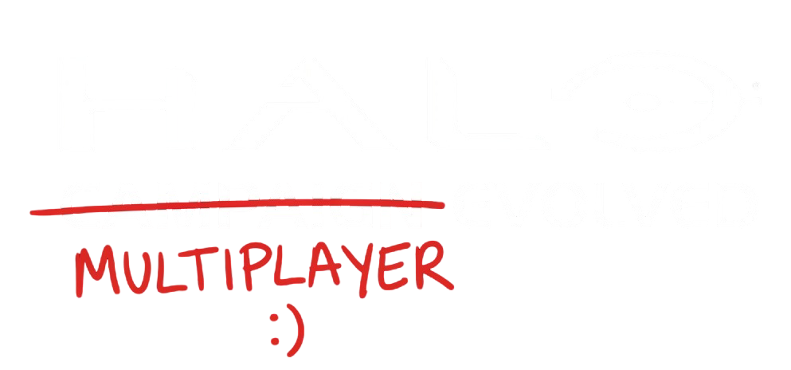

<div align="center">

<!-- Logo goes here. Drop it at docs/logo.png and it appears automatically. -->


# Halo Multiplayer Evolved

**The multiplayer Halo: Campaign Evolved should have shipped with.**

[](https://github.com/k3sra/halo-multiplayer-evolved/releases/latest)
[](https://github.com/k3sra/halo-multiplayer-evolved/releases/latest)
[](LICENSE)


</div>

---

The remake brought back the campaign and left the multiplayer behind. This puts it
back the way it was: the same modes, the same maps, the same feel. Not new content,
not a reinterpretation. The thing that was missing.

Play with friends over Steam. **No port forwarding, no launcher, no accounts.**

---

## Install

Both you and whoever you play with need the mod. It takes about thirty seconds.

**1.** [Download the latest release.](https://github.com/k3sra/halo-multiplayer-evolved/releases/latest)

**2.** Copy these three things into your game folder:

| | |
| --- | --- |
| `version.dll` | |
| `ForgeEvolved.dll` | |
| `ForgeEvolved/` | the folder |

into

```
Halo Campaign Evolved\Meteorite\Binaries\Win64\
```

> On Steam you can find that folder with **right click the game → Manage → Browse
> local files**, then open `Meteorite\Binaries\Win64`.

**3.** Start the game. There is now a **MULTIPLAYER** option at the top of the main
menu.

That is the whole install. To uninstall, delete those three things.

### It updates itself

You never have to come back here. The mod checks for a new version every time the
game starts, downloads it quietly in the background, and installs it the next time
you launch. The lobby shows you what it is doing in the top right corner.

If an update ever goes wrong, the previous version is kept next to it as
`ForgeEvolved.dll.backup`, so nothing is lost.

### Is this safe for my game?

It never modifies your game files. If anything it needs is missing it simply does
nothing and writes the reason to `ForgeEvolved.log`. It cannot half-work and leave
you with a broken install.

---

## Roadmap

The goal is a 1:1 recreation of Halo: Combat Evolved multiplayer. Nothing more
imaginative than that.

| | Goal | State |
| --- | --- | --- |
| 1 | Two players in one lobby | In progress |
| 2 | A match both players are in | Next |
| 3 | Slayer and Capture the Flag scoring exactly as they were | Planned |
| 4 | The original maps: Blood Gulch, Sidewinder, Hang 'Em High, the rest | Planned |
| 5 | Every original mode: King of the Hill, Oddball, Race, Juggernaut | Planned |
| 6 | Original weapon and vehicle balance, untouched | Planned |

---

## Status

What works today, honestly. Anything not yet tested says so.

**Working in game**

- The MULTIPLAYER menu entry, and the full lobby screen behind it
- Mode and map selection
- Team slots, and inviting people straight into your session
- Server browser with mode, slots and ping filters
- Starting a match
- Hosting a session others can find
- Checking for, downloading and installing updates

**Built, not yet proven with two people**

- The relay transport and listen server
- The wire protocol and its authorization rules
- Synchronized match launch

**Not done yet**

- A second player actually joining. This is the next thing, and everything after it
  depends on it
- Slayer and CTF scoring
- The original multiplayer maps

---

## Problems, questions, ideas

Use **[GitHub Issues](https://github.com/k3sra/halo-multiplayer-evolved/issues)**.
Please include your `ForgeEvolved.log`, which sits in the same folder you installed
into. It says what went wrong and it saves a lot of guessing.

---

## For developers

Everything technical lives in the docs rather than here.

| Document | What is in it |
| --- | --- |
| [Architecture](docs/00-ARCHITECTURE.md) | Why the game's simulation is a Blam engine, and what that means |
| [Engine binding](docs/04-ENGINE-BINDING.md) | Measured findings about the shipped binary |
| [Map format](docs/02-MAP-FORMAT.md) | The map model and its canonical binary form |
| [Packaging](docs/03-PACKAGING-AND-NEXUS.md) | How releases are built and published |

Building needs Visual Studio 2022 with the C++ desktop workload, and nothing else.
No SDK, no package manager.

```bash
build.bat install
```

---

## Credits

Built on findings shared by
**[devnull9090](https://github.com/devnull9090)** and the
**[mjolnir-core](https://github.com/devnull9090/mjolnir-core)** project, which is
doing parallel work on the same game. Their engine research and their README
structure both fed directly into this.

## Contributing

Pull requests welcome. `main` is protected, so open one against `dev`.

Match the surrounding code. Comments explain why a decision was made, not what a
line does.

## Licence

MIT. See [LICENSE](LICENSE).

Not affiliated with Microsoft, 343 Industries or Valve. Halo is a trademark of
Microsoft.
